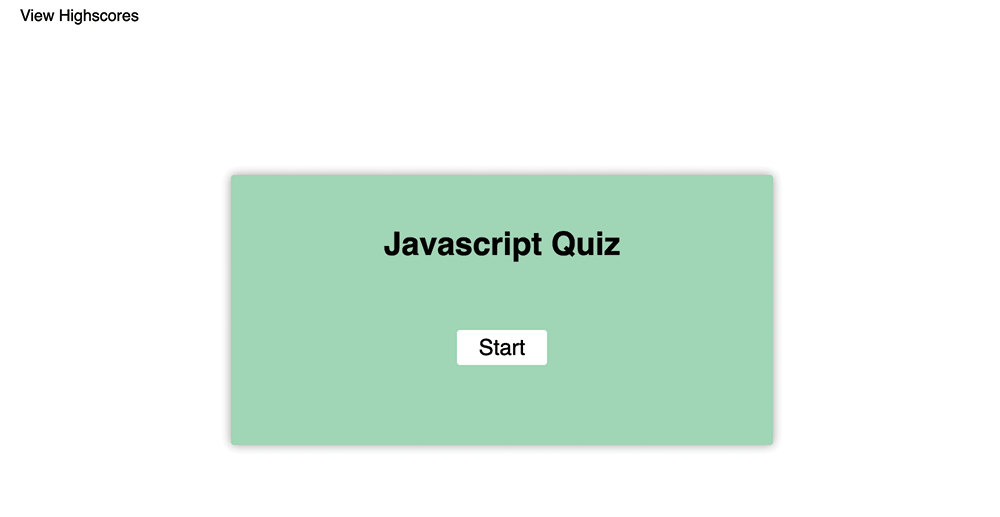

# 04 Web APIs: Code Quiz

## User Story

```
AS A coding boot camp student
I WANT to take a timed quiz on JavaScript fundamentals that stores high scores
SO THAT I can gauge my progress compared to my peers
```

## Description
* Click the start button to begin quiz
* The quiz will run for 60 seconds & to complete click through the answers you believe are correct
* Once you have completed the quiz, you will recivee your score & then taken to the highscores tally page.


# Installation
1. Launch [LexMastro GitHub](https://github.com/LexMastro) & select 'coding-quiz' repository

2. Clone the repository 
```bash
git clone git@github.com:LexMastro/coding-quiz/.git
```
3. Open `index.html` in web browser to use password generator

## Examples



## License 
This project is licensed under the [MIT License](LICENSE)
